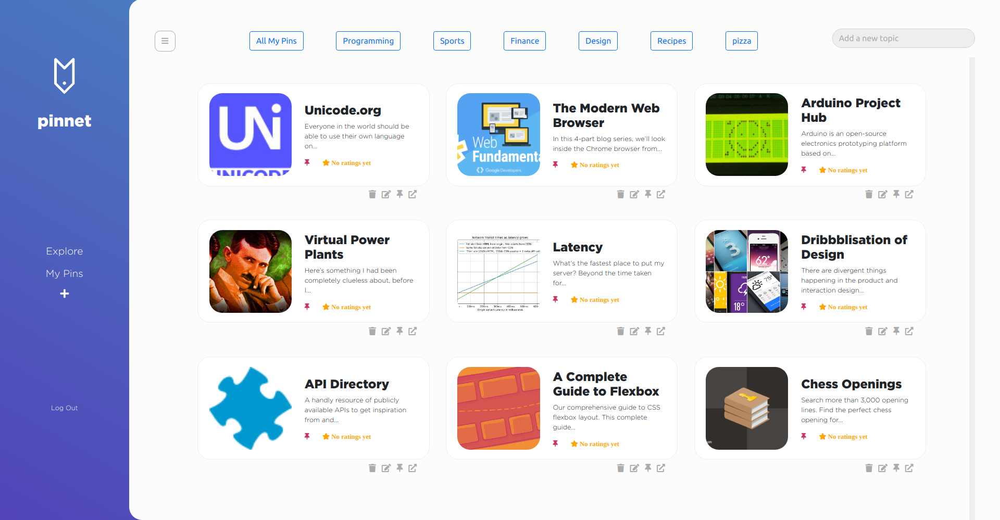
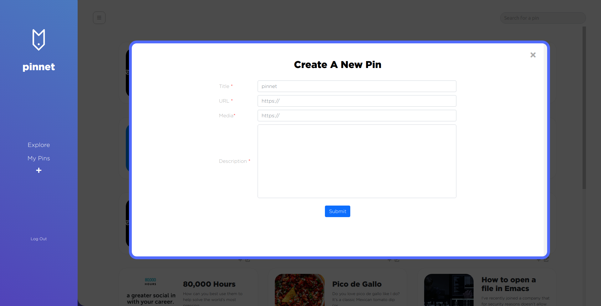

# Pinnet

Pinterest-inspired 'resource wall' app using jQuery, Express, and PostgreSQL. Users can explore, save, and organize links to their favorite resources and like, comment or rate those of others.

## Screenshots

#### My Pins

#### New Pin Form

## Stack

#### Front-End
- jQuery v3.0
- Bootstrap v4.6

#### Back-End
- Node v10.23
- Express v4.17
- PostgreSQL 

## Getting Started

- Set up the PostgrSQL db and copy from `.env.example`
- Install all dependencies with `npm install`
- Run `npm start` and visit the local server on port 8080
- Register a dummy account to add new resources, save favourites, and categorize them
